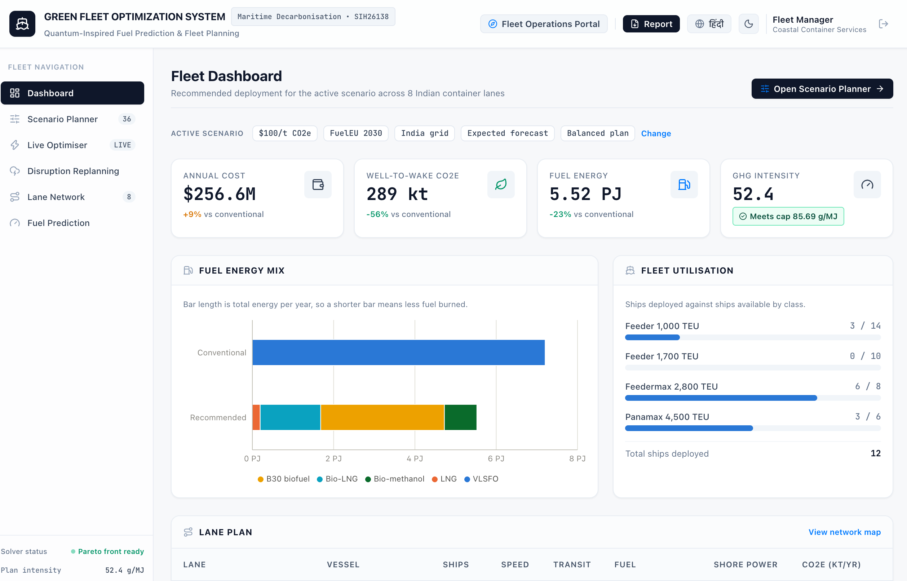
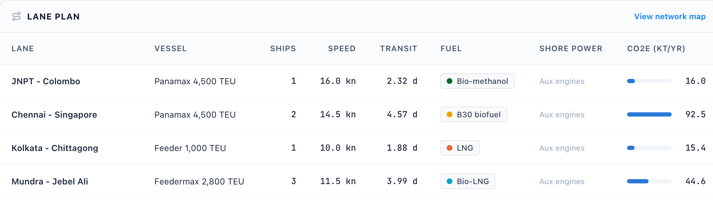
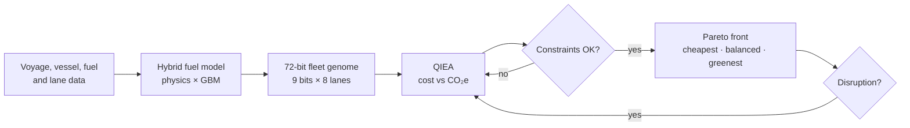

<div align="center">

# Green Fleet Optimization System

**Quantum-inspired fuel prediction and green fleet planning for eight Indian container lanes**

Smart India Hackathon 2026 · Problem Statement **SIH26138** · Team **C-Suite**

[](https://sih-green-fleet.onrender.com/)

     



</div>

---

## What it does

Fuel is a fleet's biggest cost and its biggest emissions source. A fleet manager has to decide **which vessel, how fast, which fuel and whether to use shore power** on every lane, while still carrying all the cargo on time and meeting emission rules. This project does that in three steps:

1. **Predict** fuel burn for any vessel, speed and sea state, with a 90% range.
2. **Optimise** the whole fleet with a quantum-inspired evolutionary algorithm (QIEA), trading annual cost against well-to-wake CO₂e.
3. **Decide and adapt**: pick the cheapest, balanced or greenest plan, check FuelEU compliance, and re-optimise live when a disruption hits.

## Results

Default scenario: $100/t CO₂e carbon price, FuelEU 2030 cap, balanced plan, against a conventional fleet running VLSFO at design speed.

| Metric | Result |
|---|---|
| Well-to-wake CO₂e | **−56%** (661 → 289 kt/yr) |
| Fuel burned | **−23%** (175.7 → 134.7 kt VLSFO-eq/yr) |
| Annual cost | +9% ($236.2M → $256.6M) |
| GHG intensity | 52.4 g/MJ, **meets** the FuelEU 2030 cap of 85.69 |
| Fuel prediction error | **3.93%** MAPE on held-out voyages |
| Real-ship check | 15.7% error on **820** EU MRV 2024 container ships after calibration |
| Early search | QIEA hypervolume **0.608** vs NSGA-II 0.192 at ~25% of budget (3.2×) |

At full budget NSGA-II is slightly ahead on 8 lanes (0.687 vs 0.675), and QIEA edges it at 32 lanes (0.719 vs 0.716). Its advantage is reaching good plans quickly.

## Features

**Fleet Operations portal**
- **Dashboard**: the recommended plan, fuel mix and fleet use for the active scenario
- **Scenario Planner**: 36 scenarios (carbon price × FuelEU cap × grid × forecast) with the full Pareto front
- **Live Optimiser**: runs the QIEA in your browser and animates the Q-bit grid
- **Disruption Replanning**: cyclone, port closure, fuel price shock, ships off-hire, biofuel supply cut
- **Lane Network**: map of the eight lanes on real coastlines
- **Fuel Prediction**: physics vs ML vs hybrid, prediction interval, feature importance

**Compliance & Analytics portal**
- FuelEU penalty and pooling, a 2025–2035 transition roadmap, real-ship validation, optimiser benchmark, method and assumptions

**Everywhere**: a one-click **PDF plan report**, dark mode, English and Hindi, and phone and tablet layouts.



## How it works



**Fuel prediction.** An admiralty-law physics baseline (design fuel × (speed / design speed)³, scaled by load) is multiplied by a gradient-boosting correction for weather (Beaufort), head sea, hull fouling and vessel effects. The same quantum-inspired search chooses the model's inputs and settings (a 15-bit genome), and split-conformal prediction gives a 90% interval used by the cautious (P90) forecast.

**Decisions.** Each lane has 9 bits: vessel class (2), cruising speed (3, from 10 to 20.5 kn), fuel (3: VLSFO, LNG, Bio-LNG, B30 biofuel, grey methanol, bio-methanol, green ammonia, green hydrogen) and shore power (1).

**Objectives.** Minimise annual cost ($M: fuel, carbon, charter, shore power) and well-to-wake CO₂e (kt/yr). Weekly cargo demand is always met, because ships are sized from demand, capacity and round-trip time.

**Constraints.** Speed limit, transit time, bunkering range, fleet size per class, fuel supply and the GHG-intensity cap. Any feasible plan ranks above any infeasible one.

**QIEA.** Each bit is a Q-bit angle θ with P(1) = sin²θ. Offspring come from superposition recombination of two archive parents, a rotation gate (Δθ = 0.05π) pulls toward good plans, and a NOT gate mutates. The Pareto archive holds 60 plans, pruned by crowding distance; the population is 20.

## Architecture

```
fleet.py                          Python: prediction, optimisation, benchmarks, 36 scenarios, roadmap
   │ writes
   ▼
frontend/src/data/results.json    precomputed results
   │ bundled at build time
   ▼
frontend/                         React 19 + Vite + Tailwind + Recharts static site
   └─ src/engine.js               QIEA + plan evaluator in JavaScript (live optimiser, replanning)
```

There is **no backend**. Everything is either precomputed by `fleet.py` or computed in the browser by `engine.js`, and `npm run check` confirms the JavaScript engine reproduces the Python results exactly.

## Quick start

Requires Node 20+.

```bash
cd frontend
npm ci
npm run dev
```

Open the local URL, pick a portal and sign in (demo roles, no password).

### Regenerate results (optional)

Requires Python 3.12+. Takes about 3 minutes.

```bash
python3 -m venv .venv
.venv/bin/pip install -r requirements.txt
.venv/bin/python fleet.py
cd frontend && npm run check
```

Real-ship calibration is optional: put the EU MRV 2024 public emission report (from [EMSA THETIS-MRV](https://mrv.emsa.europa.eu)) at `data/mrv/mrv_2024.xlsx`. Without it, `fleet.py` skips that step.

### Deploy

`render.yaml` is a Render Blueprint for a free static site. In Render choose **New → Blueprint** and select this repo. Every push redeploys. After re-running `fleet.py`, commit `frontend/src/data/results.json` so the site picks up the new results.

## Project layout

| Path | Purpose |
|---|---|
| `fleet.py` | The whole Python pipeline |
| `frontend/src/engine.js` | Browser QIEA and plan evaluator |
| `frontend/src/pages/` | Portal pages |
| `frontend/src/Report.jsx` | Printable plan report |
| `frontend/engine.check.mjs` | Checks the JS engine against Python |
| `basemap.py` | Builds the map outline from Natural Earth |
| `render.yaml` | Deploy config |

## Limits

- The fuel model is trained on synthetic voyages, then calibrated per vessel class on real EU MRV data, which covers EU voyages only.
- Fuel prices and emission factors are illustrative; verify them before real use.
- FuelEU caps are applied to Indian lanes as a what-if scenario, not as current law.
- Roadmap years are optimised independently; transition costs between years are not modelled.
- "Quantum-inspired" means classical algorithms using Q-bit representations. No quantum hardware is used.

## References

- Han & Kim (2002). Quantum-inspired evolutionary algorithm for a class of combinatorial optimization. *IEEE Trans. Evolutionary Computation*, 6(6), 580–593.
- Deb et al. (2002). A fast and elitist multiobjective genetic algorithm: NSGA-II. *IEEE Trans. Evolutionary Computation*, 6(2), 182–197.
- Psaraftis & Kontovas (2013). Speed models for energy-efficient maritime transportation. *Transportation Research Part C*, 26, 331–351.
- Regulation (EU) 2023/1805 (FuelEU Maritime).
- Map data: [Natural Earth](https://www.naturalearthdata.com) (public domain).

<div align="center">

Built by **Team C-Suite** for Smart India Hackathon 2026

</div>
